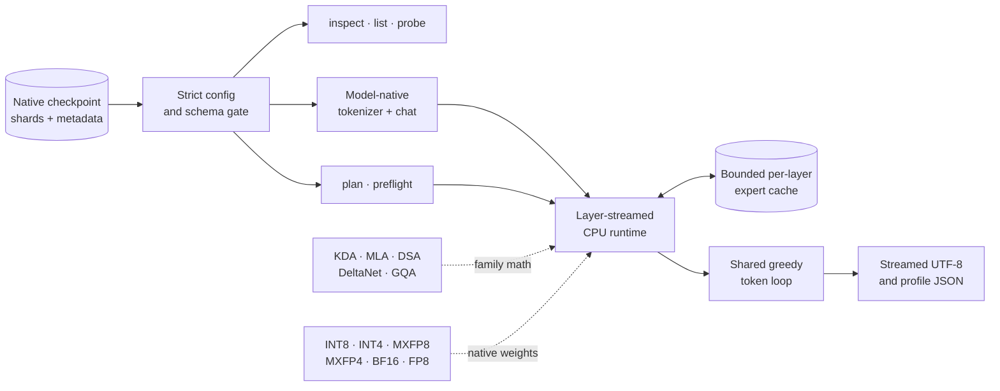

<div align="center">

<p>

</p>

<h3>Frontier MoE checkpoints, made runnable.</h3>

<p>
English · <a href="README_CN.md">中文</a>
</p>

<p>
A pure-Rust research runtime for understanding and running frontier models such as<br>
GLM-5.2, DeepSeek-V4/V4.1, Kimi-K3, Qwen3.8, and Hy4 on bounded-memory, CPU-only machines.
</p>

<p>


<a href="LICENSE"></a>
</p>

<table>
<tr>
<td align="center"><b>2.78T</b><br><sub>maximum parameter count</sub></td>
<td align="center"><b>6</b><br><sub>model adapters</sub></td>
<td align="center"><b>6</b><br><sub>public generation paths</sub></td>
<td align="center"><b>415</b><br><sub>default tests passing</sub></td>
<td align="center"><b>0</b><br><sub>GPUs required</sub></td>
</tr>
</table>

<p>
<a href="#quick-start">Quick start</a> ·
<a href="#how-it-works">How it works</a> ·
<a href="#model-coverage">Model coverage</a> ·
<a href="#validation">Validation</a> ·
<a href="#cli-reference">CLI</a> ·
<a href="#development">Development</a>
</p>

</div>

> [!WARNING]
> Urbilateria is an experimental learning and model-forensics project. Its scalar runtimes favor
> readable, runnable behavior over production throughput. Large-checkpoint generation works for
> GLM-5.2, DeepSeek-V4/V4.1, Kimi-K3, Qwen3.8, and Hy4, but numerical accuracy, output quality, memory
> use, and speed carry no production guarantees. DeepSeek-V4.1 includes a scalar base-text
> generation path validated against an independent real-weight BOS oracle, with batched prompt
> prefill and weight residency planned within the RAM budget.

## Why Urbilateria?

Most inference frameworks need staggering GPU resources to run frontier models. Urbilateria lets
you experience these checkpoints with just a CPU, a fast SSD, and a reasonable amount of RAM.

It is implemented entirely in Rust. No Python framework participates in the inference path, and no
model weights are included in this repository.

## Quick Start

Building from source requires Rust 1.88 or newer. With rustup, this repository automatically selects Rust 1.88.0
using `rust-toolchain.toml`, including rustfmt and Clippy.

Version 0.2.1 adds multi-turn TUI chat and live generation metrics; see
[CHANGELOG.md](CHANGELOG.md) for all changes.
After publication, [GitHub Releases](https://github.com/inspirewind/Urbilateria/releases) will
provide binaries for Linux x86_64 (glibc 2.35+) and Apple Silicon macOS (deployment target 13+,
tested on 15). They include the UI and need no Rust installation. See
[RELEASING.md](RELEASING.md) for archive contents and checksum verification.

Build the release binary and inspect the available commands:

```bash
cargo build --release --locked
./target/release/urb help
```

For an interactive terminal interface on Linux or macOS:

```bash
./target/release/urb ui                 # select a model with /inspect
./target/release/urb ui /path/to/model  # then run /inspect
```

The UI provides a scrollable transcript, multiline Unicode input, session history,
slash-command completion, and background model analysis, tokenization and streamed generation.
Commands are `/inspect`, `/plan`, `/preflight`, `/list`, `/explain`, `/probe`, `/tokenize`, `/decode`, `/generate`, `/settings`,
plus `/help`, `/version`, `/clear`, and `/quit`. Use **Enter** to run, **Ctrl+J** or
**Alt+Enter** for a newline, **Tab** to complete, **Up/Down** for history at the input boundaries,
**PgUp/PgDn** to scroll, and **Ctrl+C** to exit. Pasted text stays in the editor until submitted.
Quote paths with spaces. The minimum terminal size is 36 columns by 10 rows.
After `/inspect`, a model card stays at the upper right while the transcript scrolls or is cleared.
Narrow terminals retain the model name and family in the header instead.

Run these commands separately inside the UI:

```text
/inspect "/path/to/model"
/plan --ram-gib 32 --context 2048
/preflight --context 2048 --expert-slots 8
/list self_attn --limit 20
/explain
/probe model.embed_tokens.weight --samples 1024
/tokenize "Hello, world" --chat --no-thinking
/decode 123,456 --skip-special
/version
```

The tensor name and token IDs above are examples; use actual values from `/list` and `/tokenize`.
`/inspect`, `/plan`, `/preflight`, and `/explain` take an optional `MODEL_DIR`.
For `/list [FILTER]`, `/probe TENSOR_NAME`, `/tokenize "TEXT"`, and `/decode TOKEN_IDS`,
select a different directory with `--model "/path/to/model"` to distinguish it from the argument.
Omitting the directory reuses the current model; a successful command updates the selection.
Analysis options apply only to that command. `/list` matches name substrings and returns 100 rows by default;
`--limit` accepts 1–100,000. `/probe` samples 8,192 values by default; `--samples` accepts
1–10,000,000. `/probe` reads only the tensor payload ranges needed for sampling.
`/tokenize` encodes raw text by default; `--chat` renders a native chat prompt.
`--no-thinking` requires `--chat` and model support (Qwen3.8 always requires thinking).
Quote text containing spaces or newlines; use `--` before literal text starting with `-`.
`/decode` preserves special tokens unless `--skip-special` is supplied.
Long results show an explicit truncation notice; narrow the filter or use the plain CLI for full output.
`/plan` defaults to detected available RAM, 2,048 context
tokens, and `--kv-bytes 4` (`2` is also accepted). On macOS, pass `--ram-gib` explicitly.
`/preflight` defaults to one context token and zero expert-cache slots per layer.
Planning reports estimates and checkpoint warnings; preflight validates headers and shows
family-specific requirements without loading weights or attempting inference.
Qwen3.8 uses `/preflight` for hybrid memory requirements and does not support `/plan`.
Kimi-K3 preflight checks schema only, so context/cache options do not affect it; `--partial`
validates visible decoder layers during a transfer without asserting checkpoint completeness.

After selecting a model, type ordinary text directly to chat. Quotes and multiline text are
preserved without shell parsing. Each reply includes previous successful conversation turns,
rendered with the selected model's native chat template. The default is 512 new tokens per turn,
with thinking enabled and automatic RAM detection on Linux. On macOS, set a RAM budget first;
the same setting can limit memory on Linux:

```text
/settings --ram-gib 32 --max-new-tokens 512
Explain sparse MoE routing.
How does that affect memory usage?
```

`/settings` shows current values. It accepts `--threads N|auto`, `--ram-gib N|auto`,
`--max-new-tokens N` and `--thinking`/`--no-thinking` (subject to model support).
Plain messages request weight loading using the same RAM/runtime checks as the CLI.
Successful model changes start a new conversation; failed changes retain the previous model
and context. `/clear` clears both displayed output and conversation context, keeping the model
card and settings. A reply already running when cleared will not enter the new context.

Conversation memory retains at most 32 complete user/assistant pairs within 512 KiB, separately
from the displayed transcript. Cancelled/failed replies are excluded; a reply larger than the
history limit is displayed but excluded with a notice. Before generation, the tokenizer removes
oldest complete pairs as needed to fit the runtime context limit and reserve the requested new
tokens; the runtime log reports the number used/dropped. A current message that cannot fit on
its own produces an error. History is held only for this UI session.

You can also generate with explicit options:

```text
/generate "Explain sparse MoE routing" --ram-gib 32 --allow-large-model --max-new-tokens 128
```

Choose a different model with `--model MODEL_DIR`; `--prompt "TEXT"` is also accepted.
The RAM value is an explicit budget, not a guarantee the checkpoint fits. Generation uses the
same experimental runtime, checks and defaults as `urb generate` (including one new token if
`--max-new-tokens` is omitted). It accepts `--threads`, `--raw-prompt`, `--no-thinking`, `--profile`,
`--profile-json` and `--profile-trace`. Non-raw `/generate` requests participate in the conversation;
raw prompts are standalone. An accepted `/generate` remembers its RAM, token, thread and thinking
settings for later plain messages, but never its profile destinations. Generated text stays in the
conversation; runtime diagnostics appear beneath the model card in the right sidebar.
**F2** expands the runtime log, including on narrow terminals; **PgUp/PgDn** scroll it and
**F2/Esc** close it. The footer shows generated and total token counts, decode speed and TTFT.
Metrics remain visible after completion and reset when the next request starts.
**Esc** stops generation and keeps partial text; close an expanded runtime view or completion
menu first. Exiting also stops the generation process and releases its model resources.
Cancellation may leave profile files incomplete. `/clear` also clears runtime logs while background work continues.
Long streams retain the latest 32 KiB/256 newlines of text and 8 KiB/64 newlines of
logs with a truncation notice; use the ordinary CLI with redirection to keep full output.
The transcript retains at most 100 entries within a 512 KiB text budget, evicting older entries.
Each request starts an independent generation process using the same `urb` executable;
weights and KV state are rebuilt each turn, using the retained text conversation. No extra runtime is needed.

The ordinary `urb generate` CLI prints a final `metrics:` summary to stderr without requiring
`--profile`. Add `--progress` for periodic human-readable snapshots, or `--progress-json` for
structured snapshots prefixed with `URB_PROGRESS ` on stderr (the two flags are mutually exclusive).
The TUI reads these same structured metrics; stdout remains generated text only.
Input count includes the rendered prompt and retained history; total is input plus generated
token IDs, including EOS. TTFT measures request start to first selected token, including loading
and prefill; it differs from the profiler's engine-only `generation.time_to_first_token` span.
Decode speed is `(generated_tokens - 1) / (last_token_time - first_token_time)`, excluding
loading and the first token. Before the first token TTFT is `—`; fewer than two tokens have no
decode rate. Live updates are emitted at token boundaries (at most 10 Hz for JSON, 1 Hz for text,
plus initial/first/final snapshots). Cancelled requests retain the last received metrics.

The UI is written in Rust with Ratatui and Crossterm. Building needs Rust and a system linker
(on macOS, install Xcode Command Line Tools); running a built binary needs neither Rust nor
Python/Node.js. Use a binary built for your OS and architecture. The terminal must support
ANSI control sequences and UTF-8. `ui` requires interactive stdin/stdout; ordinary CLI commands
remain suitable for pipes and `--json`. Profiling keeps the CLI's platform-specific counter
availability. Build without the interface using
`cargo build --release --locked --no-default-features`.

Start with metadata. These commands do not need to read the full tensor payload:

```bash
# Static parameter and quantization X-ray
./target/release/urb inspect /path/to/model

# RAM, context, KV, scratch, and expert-cache plan
./target/release/urb plan /path/to/model --ram-gib 32 --context 2048

# Exact runtime tensor and memory validation
./target/release/urb preflight /path/to/model --context 2048 --expert-slots 8
```

Try the model-native tokenizer and chat template:

```bash
./target/release/urb tokenize /path/to/model "Explain sparse MoE routing" --chat
```

Run the `generate` command:

```bash
./target/release/urb generate /path/to/model \
  --prompt "Explain sparse MoE routing" \
  --ram-gib 32 \
  --max-new-tokens 8 \
  --no-thinking \
  --allow-large-model
```

`generate` requires an explicit RAM limit and `--allow-large-model`; a short generation can still
read many gigabytes from storage. The public command supports GLM-5.2, DeepSeek-V4,
DeepSeek-V4.1, text-only Kimi-K3, text-only Qwen3.8, and Hy4 today. Qwen3.8 uses the release's
always-thinking chat template, so omit `--no-thinking` for that model. Hy4 generation is exact through 2,048 total
prompt+generation tokens, where its top-2,048 DSA selection contains the complete causal history.

## How It Works



The runtime keeps the working set explicit rather than pretending the checkpoint is resident:

| Memory class | What lives there | How Urbilateria controls it |
| --- | --- | --- |
| **Resident** | configuration, tokenizer, root vectors, model state | validated once against the requested RAM ceiling |
| **Layer-streamed** | decoder trunks, large rows, vocabulary head chunks | loaded in execution order and released at layer boundaries |
| **Cache-bounded** | routed MoE experts | deterministic per-layer LRU with an explicit slot budget |
| **Sequence state** | MLA KV, KDA/DeltaNet recurrence, convolution, GQA KV | calculated from exact family geometry and requested context |
| **Scratch** | activations, quantization blocks, batched prompt work | included in preflight before payload reads begin |

Large matvec output rows run on one persistent CPU worker pool. Prompt ingestion is layer-wise for
DeepSeek-V4/V4.1, Kimi-K3, Hy4, and the Qwen3.8 library runtime: one decoder layer is loaded for the
entire prompt, and only the final prompt token reaches the vocabulary-sized LM head.
Adapters that stream a BF16 vocabulary head use a fixed-residency, queue-depth-aware pipeline. Up to
eight I/O workers read adjacent subdivisions while the CPU pool computes the current one; all raw
buffers together stay within the former single-chunk budget and are reused as the window advances.

DeepSeek-V4 uses spare authorized RAM before generation to retain decoder layers and the compact
BF16 LM head while preserving at least one complete routed-expert stripe. If the budget is smaller,
it uses a streamed vocabulary head and pipelines decoder-layer reads with compute. Under partial
layer residency, up to three persistent layer slots are exchanged for a four-layer read-ahead
window, so storage can run farther ahead without increasing the conservative peak-RAM allowance; fully resident and
minimum-memory configurations retain their existing behavior. On GNU/Linux, plans that stream any
decoder layers also keep weight allocations up to 64 MiB in the bounded glibc arenas. Successive
same-shaped layers therefore reuse already-faulted pages instead of repeating anonymous
`mmap`/`munmap` cycles; fully resident plans leave the allocator threshold unchanged to avoid
retaining prefill scratch that they cannot reuse. Independently of that allocator hint, a retired
streamed layer donates its native MXFP8/MXFP4 payload and scale buffers to the next compatible
prefetch task; exact-size buffers are overwritten in physical shard order while the existing
read-ahead depth and RAM plan stay unchanged. Once every payload of a target layer has passed its
first validation, later decode reloads retain all shape checks but skip the redundant linear scan
of the same immutable quantized bytes. Decoder normalization, bias, sink, and hyper-connection
vectors are read once in physical shard order and shared by every reload through immutable
`Arc` storage; the planner charges this under-2-MiB cache explicitly. Fully resident layers never
enter either reuse path. Routed
experts that fit together compute concurrently and share one activation quantization. For an
ordered single-token route batch no larger than the layer cache, the runtime simulates the serial
LRU accesses, evicts exactly their inevitable victims up front, then loads and computes the batch
concurrently before replaying its logical accesses in order. Larger batches retain the bounded
fallback: one reserved transient expert pipelines the next storage read with the current expert's
compute without exceeding the RAM plan. Evicted native MXFP4 experts donate their
payload buffers to the next miss, whose six scale/payload ranges are read in physical shard order.
During layer-wise prefill, the active layer temporarily borrows globally unused expert slots and
groups up to 24 routing tokens by expert; exact MXFP4 kernels internally split groups above twelve.
Logical
cache accesses are then replayed in token/expert order before the borrowed capacity is returned.
Batch misses are submitted to the bounded I/O pool up front, so blocking reads and cached-expert
MXFP4 compute can overlap without occupying the Rayon compute workers. When a window's unique-expert
union exceeds the active layer's available slots, the runtime no longer falls back for the entire
layer token by token. It orders experts by last use and repeatedly reuses cache-sized parallel
chunks, preserving cross-token batching and the final token-major LRU hot set within the fixed RAM
budget. The same prefill path batches the independent Q/KV and output projections before replaying
causal attention in token order; exact
multi-input AVX2 kernels cover both ModelOpt 1x32 and block-quantized 128x128 MXFP8 layouts, including
grouped output row ranges and compressor/indexer projections. Streamed BF16 matvecs defer payload
finiteness checks to the already mandatory per-row result validation, preserving NaN/infinity
rejection while avoiding a redundant full scan of large vocabulary heads across model runtimes.
The default CPU pool uses one worker per available physical core; `--threads` remains an explicit
override for measurement or unusual topologies, avoiding the cache/bandwidth regression from SMT.
Decode rollback and sparse attention use incremental/no-copy KV views, so their copy cost does not
grow with compressed history.

## Model Coverage

| Capability | GLM-5.2 | DeepSeek-V4 | DeepSeek-V4.1 | Kimi-K3 | Qwen3.8 | Hy4 |
| --- | --- | --- | --- | --- | --- | --- |
| **Checkpoint ABI** | converted Colibri | native 48-shard | native 48-shard; 96,085 tensors | native 96-shard | native 213-shard | native 130-shard |
| **Tokenizer / chat** | byte-BPE | native text chat | native text chat + numeric effort | TikToken + XTML | always-thinking ChatML | native reasoning/no-think |
| **Native weights** | INT8/INT4 | 128×128 MXFP8 + MXFP4 | 32×32 MXFP8 + MXFP4 | BF16 + MXFP4 | block FP8 | ModelOpt MXFP8 |
| **Attention path** | MLA | local + compressed | CED + CSA2 + Engram + mHC | KDA + MLA | DeltaNet + GQA | iHC + MLA/DSA |
| **Public CLI generation** | Experimental | Experimental | Experimental, text base runtime | Experimental | Experimental | Experimental, ≤2,048 tokens |
| **Multimodal execution** | No | No | Schema only | Schema only | No | No |

### What “native” means

**GLM-5.2.** The runtime expects a converted Colibri-style checkpoint rather than the official FP8
release. It supports resident core weights plus streamed experts in the converted container.

**DeepSeek-V4.** Urbilateria reads the release's 48-shard layout directly in Rust: config,
tokenizer, safetensors headers, E8M0 scale sidecars, MXFP8 matrices, and packed low-nibble-first
MXFP4 experts. DSpark tensors are schema-validated but speculative decoding is disabled.

**DeepSeek-V4.1.** The separate adapter validates the 40-layer CED graph, CSA2 ownership, 32×32
MXFP8 ABI, 384-way experts, two Engram tables, vision tower, and three DSpark stages. Public scalar
text generation executes the complete CED/CSA2/Engram/mHC base path with trained compressed
caches, exact bounded Engram reads and top-6 MoE. Decoder layers and the LM head are retained
within the RAM budget or streamed as needed. An independent
PyTorch real-weight BOS oracle gates routing across all 40 layers and the final top-16 logits.
Prompt prefill batches projections by layer and overlaps adjacent layer reads with computation;
vision and DSpark remain schema-only.

**Kimi-K3.** The text runtime streams 92 sparse layers of 896-way native MXFP4 routed experts,
keeps the compact BF16 trunk bounded by layer, and preserves recurrent KDA plus compressed MLA
state. XTML is assembled from trusted structural segments and escaped untrusted content. Generation
stops on `<|end_of_msg|>` (163586), not the tokenizer metadata's `[EOS]` token (163585).

**Qwen3.8.** The adapter is pinned to `model_type="qwen3_5_moe_text"` and the released
`Qwen/Qwen3.8-2.4T-A95B-FP8` ABI. It implements the base 92-layer text forward, top-10/512 routed
experts, gated shared experts, final norm, and LM head. MTP tensors are schema-validated but are not
part of the base autoregressive forward. The official checkpoint has passed a complete header gate
and an independent 92-layer plus full-LM-head oracle. Tiny FP32/BF16 graph fixtures and a bounded
real E4M3 expert payload oracle additionally pin dtype boundaries and quantized projection math.

**Hy4.** The adapter is pinned to `model_type="hy_v4"` and `HYV4ForCausalLM`. It validates the
complete 78-layer base plus native MTP payload, reads ModelOpt MXFP8 weights without conversion,
and slices a single routed expert from the consolidated 256-expert tensors. The tokenizer/chat,
identity-HC reference math, header/probe/preflight paths, and bounded-memory planner are wired.
The checkpoint advertises 1,048,576 positions, but exact execution remains capped at 2,048 until
Gated DSA/IndexCache and activation-quantization semantics pass an independent logits oracle.

## Checkpoint Setup

Install the Hugging Face CLI only for downloading checkpoints; it is not an inference dependency:

```bash
python3 -m pip install --upgrade huggingface_hub
```

<details>
<summary><b>GLM-5.2 converted checkpoint</b></summary>

The compatible converted checkpoint is
[`mateogrgic/GLM-5.2-colibri-int4-with-int8-mtp`](https://huggingface.co/mateogrgic/GLM-5.2-colibri-int4-with-int8-mtp).

```bash
hf download mateogrgic/GLM-5.2-colibri-int4-with-int8-mtp --dry-run

hf download mateogrgic/GLM-5.2-colibri-int4-with-int8-mtp \
  --local-dir /path/to/glm-5.2-colibri
```

</details>

<details>
<summary><b>Hy4-preview-FP8 native checkpoint</b></summary>

```bash
hf download tencent/Hy4-preview-FP8 --local-dir /path/to/hy4-preview-fp8

./target/release/urb inspect /path/to/hy4-preview-fp8
./target/release/urb preflight /path/to/hy4-preview-fp8 --context 2048 --expert-slots 1
```

The strict release gate expects all 130 shards.

</details>

<details>
<summary><b>DeepSeek-V4/V4.1 and Kimi-K3 native checkpoints</b></summary>

Point Urbilateria at the model release directory after its native shards, `config.json`, tokenizer,
and index files have finished downloading. No Transformers/Python conversion is performed.

Kimi transfers can be checked before all 96 shards arrive. Dot-prefixed rsync temporary files are
ignored, and every decoder layer fully represented by completed exact `.safetensors` files is
validated:

```bash
./target/release/urb preflight /path/to/Kimi-K3 --partial
```

</details>

<details>
<summary><b>Qwen3.8 metadata-first setup</b></summary>

Before downloading roughly 2.5 TB of tensor payload, fetch the five small release files needed for
configuration, tokenizer, and manifest development:

```bash
hf download Qwen/Qwen3.8-2.4T-A95B-FP8 \
  --revision d2dc35658bcf77e66643428cb52e774cc3b5bd29 \
  --include config.json generation_config.json tokenizer.json tokenizer_config.json model.safetensors.index.json \
  --local-dir /path/to/qwen3.8-metadata
```

After all 213 shards arrive, preflight and run the text-only always-thinking path:

```bash
./target/release/urb preflight /path/to/Qwen3.8-2.4T-A95B-FP8 --context 64 --expert-slots 0
./target/release/urb generate /path/to/Qwen3.8-2.4T-A95B-FP8 \
  --prompt "Hello" --ram-gib 4 --max-new-tokens 1 --allow-large-model
```

The 4 GiB example is above the measured ~2.04 GiB scalar-runtime peak for a 64-token context, but
the native 2.496 TB checkpoint still makes even short generation storage-bound and very slow.

</details>

Large checkpoints need ample local storage and NVMe bandwidth. Re-running the same `hf download`
command resumes completed work. Use `hf auth login` only when Hugging Face requests authentication.

## Validation

Urbilateria separates “the file looks plausible” from “the model produces the right logits.” Each
layer of confidence has its own gate:

```text
1  Config gate       exact geometry, token IDs, quantization contract
2  Header gate       tensor names, dtypes, shapes, byte lengths, shard assignment
3  Tiny oracle       deterministic end-to-end graph against independent fixtures
4  Payload gate      bounded reads decode real quantized bytes exactly
5  Runtime gate      full real layer/token execution under the memory contract
6  Output gate       independent full logits and known-token continuation
```

| Family | Strongest completed evidence represented in the repository | Remaining public gate |
| --- | --- | --- |
| GLM-5.2 | tiny full-model oracle; real converted-checkpoint token regressions | throughput optimization |
| DeepSeek-V4 | independent tiny oracle; real layer/token and tokenizer regressions | sustained performance work |
| DeepSeek-V4.1 | exact headers, native MX payloads, complete Engram/CSA2/mHC base forward and public generation, layer-wise prefill, real 40-layer BOS routing and top-16-logit oracle | vision and DSpark execution |
| Kimi-K3 | independent full-stack logits parity and known `Paris` continuation | sustained performance and revision-by-revision validation |
| Qwen3.8 | independent tiny FP32/BF16 graph, real FP8 expert payload, and real 92-layer full-logits oracles | sustained performance and multi-token release validation |
| Hy4 | upstream iHC/Gated-MLA semantics; exact schema/MXFP8/expert payload gates; real 78-layer token and public CLI generation smoke | independent full-logits parity and >2,048-token IndexCache execution |

For the Qwen3.8 release token `Hello`, the independent PyTorch streamer and Rust runtime select the
same argmax and the same top 20 tokens. Across all 248,320 logits, cosine similarity is
`0.9999224`, mean absolute error is `0.028373`, and maximum absolute error is `0.1875`. Twenty-three
layers exchange 24 of 920 expert positions at the top-10 routing boundary because the two backends
use different GEMM reduction trees; the gate bounds aggregate replacements to 32. The isolated
real FP8 expert gate remains exact to one BF16 ULP.

The model-free suite is fast and does not need a checkpoint:

```bash
cargo test --all-targets --locked
```

Current Linux result: **415 passed, 0 failed**, with real-checkpoint tests explicitly ignored unless
their model directory is supplied.

<details>
<summary><b>Run representative real-checkpoint gates</b></summary>

```bash
URB_DEEPSEEK_V4_DIR=/path/to/DeepSeek-V4-Flash-0731 \
  cargo test --release --locked --test deepseek_v4_real -- --ignored

URB_GLM52_DIR=/path/to/colibri-glm-5.2 \
  cargo test --release --locked --test glm_real -- --ignored

KIMI_K3_MODEL_DIR=/path/to/Kimi-K3 \
KIMI_K3_REFERENCE_LOGITS=/path/to/kimi-k3-in-c/tests/fixtures/golden/ref_logits.json \
  cargo test --release --locked --test kimi_k3_real \
  real_checkpoint_logits_match_the_independent_pytorch_golden -- --ignored --exact --nocapture

KIMI_K3_MODEL_DIR=/path/to/Kimi-K3 \
  cargo test --release --locked --test kimi_k3_real \
  real_checkpoint_completes_france_with_paris -- --ignored --exact --nocapture

HY4_MODEL_DIR=/path/to/hy4-preview-fp8 \
  cargo test --release --locked --test hy4_real -- --ignored --nocapture
```

</details>

## CLI Reference

| Command | Purpose | Model support |
| --- | --- | --- |
| `ui [MODEL_DIR]` | Interactive terminal with history, completion, background analysis, tensor browsing, tokenization and streamed generation; 13 commands | Linux/macOS; same model coverage and generation limits as corresponding CLI commands |
| `inspect` | Build a static parameter, quantization, tensor, and routing X-ray | All six adapters |
| `plan` | Estimate resident, KV, scratch, and expert-cache budgets | GLM, DeepSeek, Kimi, Hy4 |
| `preflight` | Validate exact runtime tensors and memory without payload reads | All six adapters |
| `list` | Search exact tensor names | All safetensors checkpoints |
| `probe` | Sample one tensor without loading the checkpoint | All safetensors checkpoints |
| `tokenize` | Encode raw text or a model-native chat turn | All six adapters |
| `decode` | Decode comma-separated token IDs | All six adapters |
| `generate` | Run RAM-planned greedy generation | All six adapters |
| `explain` | Print the token path and tensor geometry | All six adapters |

Every analysis command that supports it can emit JSON for automation. Run `urb help` for the exact
flags and defaults.

### Prompt safety

Ordinary user text is rendered through the model-native chat protocol. Use `--no-thinking` to
disable reasoning where that family permits it. `--raw-prompt` is a trusted escape hatch only for
a fully rendered prompt beginning with the model's native BOS/protocol prefix; bare text is rejected
because it can otherwise produce immediate EOS or unrelated output.

Kimi-K3 makes the trust boundary explicit: protocol markers are emitted only by typed structural
segments, while user, assistant, and tool content remain ordinary escaped segments. Qwen3.8's
official template always requires thinking, so `--no-thinking` is invalid for that family.

## Profiling

Human-readable profiles go to stderr. Stable-schema JSON goes only to the requested file, never into
streamed model output. Timings are inclusive, so nested stages intentionally overlap. On Linux,
profile schema v2 also samples process CPU, RSS/swap, page faults, thread count, system memory, and
process I/O every 100 ms, with an exact final sample. `storage_read_bytes`/`storage_write_bytes` are
Linux storage-layer accounting; `read_char_bytes`/`write_char_bytes` include page-cache traffic.
Neither should be confused with a stage's logical checkpoint payload or whole-device utilization.

```bash
./target/release/urb generate /path/to/model \
  --prompt "Hello" --ram-gib 32 --max-new-tokens 1 --no-thinking \
  --allow-large-model --threads 20 --profile \
  --profile-json profile-20.json --profile-trace profile-20.trace.json
```

`--profile-trace` enables bounded per-span recording and writes Chrome Trace Event JSON. Open the
trace directly in [Perfetto UI](https://ui.perfetto.dev/), or open
[`tools/profile_viewer.html`](tools/profile_viewer.html) locally and drop both JSON files onto it.
The dependency-free viewer provides stage ranking, resource charts, thread filtering, search,
zoom/pan, and a time-ordered flame chart. Trace collection is disabled unless the flag is present.
DeepSeek-V4 trace spans attach token position/ID, layer ID, expert ID, pre-batch cache residency,
batch size, and a stable per-layer flow ID where those values are meaningful.

Use `--threads 1` as the serial baseline. Without `--threads`, the persistent worker pool uses the
platform's available logical parallelism. More threads are not always faster on SMT or hybrid-core
CPUs, so compare several values on the same prompt and cache state.

A model-free release benchmark exercises the same F32 kernel and profiler:

```bash
URB_BENCH_THREADS=1 cargo run --release --example profile_matvec --locked
URB_BENCH_THREADS=20 cargo run --release --example profile_matvec --locked
```

It reports dimensions, requested and effective workers, latency percentiles, GMAC/s, checksum, and
the full profile. `URB_BENCH_ROWS`, `URB_BENCH_COLS`, and `URB_BENCH_ITERATIONS` override defaults.

<details>
<summary><b>Real-checkpoint performance harness</b></summary>

Ignored `inference_performance` tests measure the same fixed-length greedy workload for GLM-5.2,
DeepSeek-V4, and Kimi-K3. Reports include engine TTFT, observed and model-only decode tokens/s,
setup stages, expert-cache telemetry, logical attention/KV growth, planned memory, and inclusive
profiles.

Run each model in a separate release test process so persistent worker pools, memory pressure, and
page-cache state do not overlap. Machine-local paths and defaults can live in the git-ignored
`.env.performance` file:

```bash
./tests/run_inference_performance.sh
```

Reports are written under `target/perf/`. Compare them only on a fixed host with identical
checkpoint, prompt, thread count, and expert-slot settings.

</details>

## Project Map

| Path | Responsibility |
| --- | --- |
| `src/analysis/` | checkpoint reports, tensor classification, probes, traces, and resource plans |
| `src/storage/` | strict safetensors indexing, bounded payload reads, and native weight loaders |
| `src/math/` | readable scalar quantization, routing, MXFP, and numerical reference operations |
| `src/models/` | family-private config, schema, prompt, attention, MoE, weights, and runtime code |
| `src/runtime/` | model-neutral runtime contracts and deterministic expert-cache mechanics |
| `src/generation.rs` | backend-independent autoregressive token loop and stop semantics |
| `src/ui/` | terminal lifecycle, input state, rendering, and the background analysis worker |
| `src/profiling.rs` | opt-in inclusive stage metrics and stable JSON reports |
| `tests/` | real-checkpoint correctness gates and cross-model performance harnesses |
| `tools/` | independent Python oracle generation used during validation, not inference |

The small shared boundaries are deliberate. A new model family should reuse storage, generation,
profiling, and runtime contracts without forcing one architecture's tensor ABI or prompt semantics
onto another.

## Development

```bash
cargo fmt --all --check
cargo test --all-targets --locked
cargo clippy --all-targets --locked -- -D warnings
cargo build --release --locked
```

CI runs model-free tests with and without `ui` on Linux (Ubuntu 24.04) and Apple Silicon macOS
(macOS 15), using Rust 1.88.0 and stable; Intel Macs are not currently covered. Formatting and
Clippy for both feature configurations use Rust 1.88.0. The terminal smoke test uses Python's
standard library to exercise all 13 commands in a PTY, including real tiny-model generation,
Unicode streaming, cancellation and process cleanup, paste, resize, blocked background
tasks, normal/signal exits, and panic cleanup. The Linux release build also runs CLI help and
TUI interaction checks. CI Cargo builds and tests use `--locked` to preserve dependency versions.
Release tooling is tested with Python's standard library. Pushing a version tag runs CI again,
packages both supported platforms, and prepares a GitHub Release draft; the full process is in
[RELEASING.md](RELEASING.md).
After building, run the terminal test locally with
`python3 tests/tui_smoke.py target/debug/urb`; CI also passes the binary test executable through
`--panic-test` to exercise the terminal-only panic test.

Behavior changes should include focused tests. Optimized kernels must remain checked against the
readable scalar reference; a faster path is not complete until its numerical contract is explicit.

## Current Limitations

- CPU-only correctness runtimes with parallel scalar matvec kernels; sustained large-model
  generation still needs SIMD/fused kernels and more I/O optimization.
- No server API, Web UI, CUDA, or Metal backend.
- The GLM path supports the converted Colibri container, not arbitrary official FP8 releases.
- DeepSeek-V4/V4.1 DSpark speculative decoding is schema-validated but disabled; the V4.1 vision
  tower is also schema-only.
- Kimi-K3 generation is text-only; MoonViT and projector tensors are validated but not executed.
- A Kimi checkpoint revision other than the tested release needs its own logits and performance
  validation before inheriting output-quality claims.
- Qwen3.8 MTP tensors are schema-validated but speculative decoding is disabled; the scalar
  generation path is suitable for correctness work, not interactive throughput.
- Hy4 generation is exact only through 2,048 total tokens; longer-context IndexCache execution and
  independent full-logits parity remain open validation milestones.
- Arbitrary Transformers architectures and quantization layouts are intentionally rejected.

## The Name

**Colibri + Ferris = Urbilateria.**

A hummingbird is a chordate and deuterostome; a crab is an arthropod and protostome. *Urbilateria*
is the name commonly given to their hypothetical last shared bilaterian ancestor, before those two
lineages diverged. It is not a known fossil species, and its actual form remains debated.

The name joins the project's two inspirations: Colibri's pursuit of low-memory inference and
Ferris's Rust ecosystem. Urbilateria brings those ideas together in an independent,
learning-oriented implementation.

## Contributing

Issues, experiments, and focused pull requests are welcome. Keep reference behavior readable,
include tests for behavioral changes, and document any new checkpoint or numerical assumptions.

## Acknowledgements

- [GLM-5.2](https://huggingface.co/zai-org/GLM-5.2-FP8) for the model architecture
- [DeepSeek-V4-Flash-0731](https://huggingface.co/deepseek-ai/DeepSeek-V4-Flash-0731) for its release configuration and standalone inference reference
- [DeepSeek-V4.1-Flash](https://huggingface.co/deepseek-ai/DeepSeek-V4.1-Flash) for the native CED/CSA2/Engram/mHC model and checkpoint
- [Kimi-K3](https://huggingface.co/moonshotai/Kimi-K3) for the released model, tokenizer, and architecture specification
- [Qwen3.8-2.4T-A95B-FP8](https://huggingface.co/Qwen/Qwen3.8-2.4T-A95B-FP8) for the release-pinned hybrid-attention MoE model
- [Hy4-preview-FP8](https://huggingface.co/tencent/Hy4-preview-FP8) for the release-pinned iHC/Gated-DSA MoE model
- [kimi-k3-in-c](https://github.com/FareedKhan-dev/kimi-k3-in-c) for an independent Apache-2.0 behavioral reference used to cross-check scalar formulas and checkpoint conventions
- [Colibri](https://github.com/JustVugg/colibri) for inspiring low-memory expert streaming
- [Rabbit](https://github.com/ferrumox/rabbit) for inspiring a Rust learning-oriented inference path

Urbilateria is an independent implementation and does not include code or model weights from these
projects.

## License

Urbilateria is licensed under the [MIT License](LICENSE).
