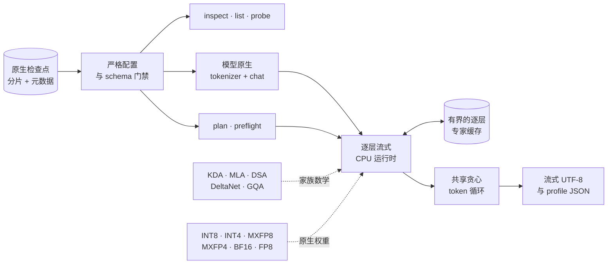

<div align="center">

<p>

</p>

<h3>让前沿 MoE 检查点变得可运行。</h3>

<p>
<a href="README.md">English</a> · 中文
</p>

<p>
一个纯 Rust 研究运行时，用于在内存有限的纯 CPU 机器上理解和运行<br>
GLM-5.2、DeepSeek-V4/V4.1、Kimi-K3、Qwen3.8 与 Hy4等前沿模型。
</p>

<p>


<a href="LICENSE"></a>
</p>

<table>
<tr>
<td align="center"><b>2.78T</b><br><sub>最大支持参数</sub></td>
<td align="center"><b>6</b><br><sub>模型适配器</sub></td>
<td align="center"><b>6</b><br><sub>公开生成路径</sub></td>
<td align="center"><b>380</b><br><sub>默认测试通过</sub></td>
<td align="center"><b>0</b><br><sub>所需 GPU</sub></td>
</tr>
</table>

<p>
<a href="#快速开始">快速开始</a> ·
<a href="#工作原理">工作原理</a> ·
<a href="#模型覆盖">模型覆盖</a> ·
<a href="#验证">验证</a> ·
<a href="#cli-参考">CLI</a> ·
<a href="#开发">开发</a>
</p>

</div>

> [!WARNING]
> Urbilateria 是一个实验性的学习与模型取证项目。其标量运行时优先考虑行为的可读性和
> 可运行性，而非生产吞吐量。GLM-5.2、DeepSeek-V4/V4.1、Kimi-K3、Qwen3.8 与 Hy4
> 已可进行大检查点生成，但数值精度、输出质量、内存占用和速度不保证生产性能。
> DeepSeek-V4.1 提供了标量基础文本生成路径，并已通过独立真实权重 BOS 预言机验证；其逐 token 提示词预填充用于正确性研究，速度较慢。

## 为什么选择 Urbilateria？

大多数推理框架运行前沿模型需要令人瞠目结舌的GPU资源。Urbilateria 则让你能够实际体验这些checkpoint，只需要cpu、高速ssd和适量内存。

纯Rust实现，推理路径不依赖任何 Python 框架。本仓库不包含模型权重。

## 快速开始

从源码构建需要 Rust 1.88 或更新版本。使用 rustup 时，仓库会通过 `rust-toolchain.toml` 自动选择
Rust 1.88.0，并包含 rustfmt 和 Clippy。

0.2.0 引入交互式 TUI，完整变更见 [CHANGELOG.md](CHANGELOG.md)。正式发布后，
[GitHub Releases](https://github.com/inspirewind/Urbilateria/releases) 将提供 Linux x86_64
（glibc 2.35+）与 Apple Silicon macOS（部署目标 13+，在 15 上测试）的预编译程序，
默认包含 UI，运行无需安装 Rust。压缩包内容与校验方法见 [RELEASING.md](RELEASING.md)。

构建 release 二进制并查看可用命令：

```bash
cargo build --release --locked
./target/release/urb help
```

在 Linux 或 macOS 上启动交互式终端界面：

```bash
./target/release/urb ui                 # 进入后用 /inspect 选择模型
./target/release/urb ui /path/to/model  # 进入后运行 /inspect
```

界面提供可滚动的结果区、多行 Unicode 输入、会话历史、斜杠命令补全，以及带耗时显示的后台
模型分析和分词。支持 `/inspect`、`/plan`、`/preflight`、`/list`、`/explain`、`/probe`、
`/tokenize`、`/decode`，以及 `/help`、`/version`、`/clear`、`/quit`。
**Enter** 执行，**Ctrl+J** 或 **Alt+Enter** 换行，**Tab** 补全，输入首行/末行的
**↑/↓** 浏览历史，**PgUp/PgDn** 滚动结果，**Ctrl+C** 退出。粘贴只进入编辑框，提交后才执行。
包含空格的路径需要加引号；终端最小尺寸为 36 列 × 10 行。

在界面中依次执行：

```text
/inspect "/path/to/model"
/plan --ram-gib 32 --context 2048
/preflight --context 2048 --expert-slots 8
/list self_attn --limit 20
/explain
/probe model.embed_tokens.weight --samples 1024
/tokenize "你好，世界" --chat --no-thinking
/decode 123,456 --skip-special
/version
```

以上张量名及 token ID 仅为示例，请使用 `/list`、`/tokenize` 返回的实际值。
`/inspect`、`/plan`、`/preflight`、`/explain` 接受可选的 `MODEL_DIR`；
`/list [FILTER]`、`/probe TENSOR_NAME`、`/tokenize "TEXT"`、`/decode TOKEN_IDS`
使用 `--model "/path/to/model"` 指定其他目录，避免与文本或张量名混淆。
省略目录会复用当前模型，命令成功后更新模型选择；参数仅对本次命令生效。
`/list` 按名称子串筛选，默认返回 100 条，`--limit` 范围为 1–100,000。
`/probe` 默认采样 8,192 个值，`--samples` 范围为 1–10,000,000；只有它会读取采样所需的张量 payload。
`/tokenize` 默认编码原始文本；`--chat` 使用原生聊天模板，`--no-thinking` 必须与它一起使用，
是否支持取决于模型（Qwen3.8 必须保留 thinking）。包含空格或换行的文本需要引号；
以 `-` 开头的正文可放在 `--` 后。`/decode` 默认保留特殊 token。
较长结果会明确提示显示已截断，可缩小筛选范围或使用普通 CLI 获取完整输出。
`/plan` 默认使用检测到的可用 RAM、2,048 个上下文 token、`--kv-bytes 4`（也接受 `2`）。
macOS 需要显式传入 `--ram-gib`。`/preflight` 默认检查 1 个上下文 token、每层 0 个专家缓存槽位。
内存规划展示估算及检查点警告；preflight 验证文件头并展示模型家族对应的需求，不加载权重或执行推理。
Qwen3.8 通过 `/preflight` 查看混合状态内存需求，不支持 `/plan`。
Kimi-K3 的 preflight 仅检查 schema，context/cache 参数不影响检查；`--partial` 用于传输过程中
验证可见的 decoder 层，不代表整个检查点完整。

界面使用 Rust、Ratatui 和 Crossterm 实现。编译需要 Rust 和系统链接器，macOS 可安装
Xcode Command Line Tools；运行编译好的程序不需要 Rust、Python 或 Node.js。
二进制需要与操作系统及 CPU 架构匹配，终端需要支持 ANSI 控制序列与 UTF-8。
`ui` 要求标准输入和输出连接交互式终端；普通 CLI 命令仍可用于管道和 `--json` 输出。
第一版未接入依赖 Linux 的运行时性能计数器。若不需要界面，可使用
`cargo build --release --locked --no-default-features` 构建。

从元数据开始。以下命令无需读取完整张量 payload：

```bash
# 静态参数与量化透视
./target/release/urb inspect /path/to/model

# RAM、上下文、KV、暂存空间与专家缓存规划
./target/release/urb plan /path/to/model --ram-gib 32 --context 2048

# 精确的运行时张量与内存验证
./target/release/urb preflight /path/to/model --context 2048 --expert-slots 8
```

试用模型原生 tokenizer 与 chat 模版：

```bash
./target/release/urb tokenize /path/to/model "Explain sparse MoE routing" --chat
```

运行 generate 命令：

```bash
./target/release/urb generate /path/to/model \
  --prompt "Explain sparse MoE routing" \
  --ram-gib 32 \
  --max-new-tokens 8 \
  --no-thinking \
  --allow-large-model
```

`generate` 要求显式指定 RAM 上限和 `--allow-large-model`；即使只生成很短的内容，
也可能从存储设备读取许多 GiB 数据。当前公开命令支持 GLM-5.2、DeepSeek-V4、
DeepSeek-V4.1、纯文本 Kimi-K3、纯文本 Qwen3.8 和 Hy4。Qwen3.8 使用该版本始终开启思考的聊天模板，
因此对该模型应省略 `--no-thinking`。Hy4 可在提示词与生成 token 总数不超过 2,048
时精确执行，此时其 top-2,048 DSA 选择包含完整的因果历史。

## 工作原理



运行时明确维护工作集，而不是假装检查点已经常驻内存：

| 内存类别 | 其中保存的内容 | Urbilateria 的控制方式 |
| --- | --- | --- |
| **常驻** | 配置、tokenizer、根向量、模型状态 | 针对请求的 RAM 上限进行一次性验证 |
| **逐层流式** | 解码器主干、大型行、词表头分块 | 按执行顺序加载，并在层边界释放 |
| **缓存受限** | 路由后的 MoE 专家 | 使用具有明确槽位预算的确定性逐层 LRU |
| **序列状态** | MLA KV、KDA/DeltaNet 循环状态、卷积、GQA KV | 根据准确的家族几何和请求的上下文计算 |
| **暂存空间** | 激活、量化块、批量提示词工作区 | 在开始读取 payload 前纳入 preflight |

大型 matvec 输出行在一个持久 CPU worker 池上运行。DeepSeek-V4、Kimi-K3、Hy4 和
Qwen3.8 库运行时按层摄取提示词：一个解码器层为整个提示词加载一次，只有最后一个
提示 token 会进入词表大小的 LM head。DeepSeek-V4.1 当前在提示词预填充与 decode
中都使用精确的逐 token 路径。
需要流式读取 BF16 词表 head 的适配器会使用固定常驻量、感知队列深度的流水线：最多
8 个 I/O worker 读取相邻子块，同时 CPU 池计算当前子块；全部原始缓冲合计仍处于原先
单块预算内，并随窗口推进持续复用。

DeepSeek-V4 会在生成前利用已授权的剩余内存驻留解码器层和紧凑 BF16 LM head，同时至少保留
一整条 routed-expert 缓存带；预算较小时会使用流式词表 head，并让解码器层读取与计算形成流水线。
在部分层可驻留时，会用最多三个长期驻留层槽位换取四层预读窗口，让存储可以进一步提前读取，同时
保持保守峰值 RAM 预算不变；层全部驻留和最低内存配置维持原有行为。
在 GNU/Linux 上，只要 RAM 规划仍需流式加载 decoder layer，运行时还会让不超过 64 MiB 的
权重分配留在受限的 glibc arena 中，使后续同形层复用已经触发过缺页的内存，而不再反复执行匿名
`mmap`/`munmap`；层全部常驻时不会修改这个阈值，以免保留无法复用的 prefill 暂存页。
除这个 allocator 提示外，执行完的流式层还会把原生 MXFP8/MXFP4 payload 与 scale 缓冲直接交给
下一项形状兼容的预读任务，按 shard 物理顺序原地覆盖，同时保持既有预读深度和 RAM 规划不变。
目标层的全部 payload 首次校验成功后，后续 decode 重载仍会执行完整形状检查，但不再线性扫描同一份
不可变的量化字节。Decoder 的归一化、bias、sink 和 hyper-connection 小向量会按 shard 物理顺序
一次性读取，并通过不可变 `Arc` 供每次重载共享；规划器会显式计入这份不足 2 MiB 的缓存。
全驻留层不会进入这两条复用路径。
能够同时驻留的 routed experts 会并行计算并共享一次激活量化。对于不超过逐层缓存容量的
单 token 有序路由批次，运行时会先模拟串行 LRU，提前精确淘汰必然被替换的旧项，再并发加载和
计算整批 expert，最后按原顺序重放逻辑访问。更大的批次仍使用有界回退路径：利用规划中预留的
一个 transient expert，让下一个专家的存储读取与当前专家计算重叠而不突破 RAM 预算。
被淘汰的原生 MXFP4 专家会把 payload 缓冲交给下一次 miss 复用，其六段 scale/payload
按 shard 中的物理顺序读取。逐层 prefill 时，当前层会临时借用全局尚未使用的 expert
槽位，并把最多 24 个路由 token 按 expert 合并；超过 12 个输入的精确 MXFP4 kernel 会在
内部安全分块。随后
仍按 token/expert 顺序重放逻辑缓存访问，再归还借用容量。批次 miss 会预先提交到有界 I/O
线程池，使阻塞读取能与已命中专家的 MXFP4 计算重叠，而不占用 Rayon 计算线程。窗口的唯一
expert 总数超过当前层可用槽位时，不再让整层退回逐 token 执行；运行时会按最后使用位置排序，
并用缓存容量大小的并行分块反复复用同一组缓冲，在固定 RAM 上保留跨 token 合批以及
token-major LRU 的最终热集。同一条 prefill 路径还会批量执行相互独立的 Q/KV 和输出投影，
再按 token 顺序重放因果注意力；数值
精确的多输入 AVX2 内核同时覆盖 ModelOpt 1×32 和 block-quantized 128×128 MXFP8，包括
grouped output row range 与 compressor/indexer 投影。流式 BF16 matvec 会把 payload 有限性
检查延后到必需的逐行结果检查，在继续拒绝 NaN/Inf 的同时，避免各模型的大型词表 head
再做一次完整扫描。默认 CPU 池为每个可用物理核分配一个 worker；仍可用 `--threads`
显式覆盖，从而避免 SMT 引起的缓存与内存带宽退化。Decode 回滚和稀疏注意力使用
增量、零拷贝 KV 视图，其复制成本不会随压缩历史增长。

## 模型覆盖

| 能力 | GLM-5.2 | DeepSeek-V4 | DeepSeek-V4.1 | Kimi-K3 | Qwen3.8 | Hy4 |
| --- | --- | --- | --- | --- | --- | --- |
| **检查点 ABI** | 转换后的 Colibri | 原生 48 分片 | 原生 48 分片；96,085 个张量 | 原生 96 分片 | 原生 213 分片 | 原生 130 分片 |
| **Tokenizer / 聊天** | byte-BPE | 原生文本聊天 | 原生文本聊天 + 数值 effort | TikToken + XTML | 始终思考的 ChatML | 原生 reasoning/no-think |
| **原生权重** | INT8/INT4 | 128×128 MXFP8 + MXFP4 | 32×32 MXFP8 + MXFP4 | BF16 + MXFP4 | block FP8 | ModelOpt MXFP8 |
| **注意力路径** | MLA | local + compressed | CED + CSA2 + Engram + mHC | KDA + MLA | DeltaNet + GQA | iHC + MLA/DSA |
| **公开 CLI 生成** | 实验性 | 实验性 | 实验性，文本基础运行时 | 实验性 | 实验性 | 实验性，≤2,048 tokens |
| **多模态执行** | 否 | 否 | 仅 schema | 仅 schema | 否 | 否 |

### “原生”的含义

**GLM-5.2。** 运行时期望的是转换后的 Colibri 风格检查点，而非官方 FP8 版本。
它支持转换容器中的常驻核心权重与流式专家。

**DeepSeek-V4。** Urbilateria 直接用 Rust 读取该版本的 48 分片布局：配置、tokenizer、
safetensors 头部、E8M0 scale sidecar、MXFP8 矩阵，以及低半字节优先打包的 MXFP4
专家。DSpark 张量会进行 schema 验证，但推测解码被禁用。

**DeepSeek-V4.1。** 独立适配器验证 40 层 CED 图、CSA2 所有权、32×32 MXFP8 ABI、
384 路专家、两个 Engram 表、视觉塔和三个 DSpark 阶段。公开的标量文本生成会执行完整的
逐层流式 CED/CSA2/Engram/mHC 基础路径，包括训练得到的压缩缓存、精确的有界 Engram
读取、top-6 MoE 和流式 LM head。独立的 PyTorch 真实权重 BOS 预言机会验证全部 40 层
的路由和最终 top-16 logits。提示词预填充仍为逐 token；视觉与 DSpark 仍仅进行
schema 验证。

**Kimi-K3。** 文本运行时以流式方式执行 92 个稀疏层中的 896 路原生 MXFP4 路由专家，
使紧凑的 BF16 主干受层边界约束，并保留循环 KDA 与压缩 MLA 状态。XTML 由可信结构
片段组装，同时转义不可信内容。生成在 `<|end_of_msg|>`（163586）停止，而不是在
tokenizer 元数据的 `[EOS]` token（163585）停止。

**Qwen3.8。** 适配器固定到 `model_type="qwen3_5_moe_text"` 以及已发布的
`Qwen/Qwen3.8-2.4T-A95B-FP8` ABI。它实现 92 层基础文本 forward、top-10/512
路由专家、门控共享专家、final norm 与 LM head。MTP 张量会进行 schema 验证，但不属于
基础自回归 forward。官方检查点已经通过完整头部门禁和独立的 92 层加完整 LM head
预言机。微型 FP32/BF16 图 fixture 和有界的真实 E4M3 专家 payload 预言机还固定了
dtype 边界与量化投影数学。

**Hy4。** 适配器固定到 `model_type="hy_v4"` 和 `HYV4ForCausalLM`。它验证完整的
78 层基础模型与原生 MTP payload，无需转换即可读取 ModelOpt MXFP8 权重，并从合并的
256 专家张量中切出单个路由专家。tokenizer/chat、identity-HC 参考数学、
header/probe/preflight 路径与有界内存规划器均已接通。检查点声明支持 1,048,576
个位置，但在 Gated DSA/IndexCache 和激活量化语义通过独立 logits 预言机前，精确执行
仍限制在 2,048。

## 检查点配置

Hugging Face CLI 仅用于下载检查点；它不是推理依赖：

```bash
python3 -m pip install --upgrade huggingface_hub
```

<details>
<summary><b>GLM-5.2 转换检查点</b></summary>

兼容的转换检查点为
[`mateogrgic/GLM-5.2-colibri-int4-with-int8-mtp`](https://huggingface.co/mateogrgic/GLM-5.2-colibri-int4-with-int8-mtp)。

```bash
hf download mateogrgic/GLM-5.2-colibri-int4-with-int8-mtp --dry-run

hf download mateogrgic/GLM-5.2-colibri-int4-with-int8-mtp \
  --local-dir /path/to/glm-5.2-colibri
```

</details>

<details>
<summary><b>Hy4-preview-FP8 原生检查点</b></summary>

```bash
hf download tencent/Hy4-preview-FP8 --local-dir /path/to/hy4-preview-fp8

./target/release/urb inspect /path/to/hy4-preview-fp8
./target/release/urb preflight /path/to/hy4-preview-fp8 --context 2048 --expert-slots 1
```

严格版本门禁要求全部 130 个分片。

</details>

<details>
<summary><b>DeepSeek-V4/V4.1 与 Kimi-K3 原生检查点</b></summary>

原生分片、`config.json`、tokenizer 和索引文件下载完成后，让 Urbilateria 指向模型
发布目录。无需进行 Transformers/Python 转换。

Kimi 的 96 个分片尚未全部到达时即可开始检查传输结果。以点开头的 rsync 临时文件会被
忽略；每个由已完成、精确的 `.safetensors` 文件完整表示的解码器层都会得到验证：

```bash
./target/release/urb preflight /path/to/Kimi-K3 --partial
```

</details>

<details>
<summary><b>Qwen3.8 元数据优先配置</b></summary>

在下载约 2.5 TB 的张量 payload 前，先获取配置、tokenizer 和 manifest 开发所需的
五个小型发布文件：

```bash
hf download Qwen/Qwen3.8-2.4T-A95B-FP8 \
  --revision d2dc35658bcf77e66643428cb52e774cc3b5bd29 \
  --include config.json generation_config.json tokenizer.json tokenizer_config.json model.safetensors.index.json \
  --local-dir /path/to/qwen3.8-metadata
```

全部 213 个分片到达后，执行 preflight 并运行纯文本、始终思考的路径：

```bash
./target/release/urb preflight /path/to/Qwen3.8-2.4T-A95B-FP8 --context 64 --expert-slots 0
./target/release/urb generate /path/to/Qwen3.8-2.4T-A95B-FP8 \
  --prompt "Hello" --ram-gib 4 --max-new-tokens 1 --allow-large-model
```

4 GiB 示例高于 64-token 上下文下实测约 2.04 GiB 的标量运行时峰值，但原生
2.496 TB 检查点仍会让短生成受限于存储速度，并且非常缓慢。

</details>

大型检查点需要充足的本地存储空间和 NVMe 带宽。重新运行相同的 `hf download`
命令会从已完成的工作继续。仅当 Hugging Face 要求认证时才使用 `hf auth login`。

## 验证

Urbilateria 将“文件看起来合理”与“模型生成正确 logits”区分开来。每一层置信度都有
自己的门禁：

```text
1  配置门禁       精确几何、token ID、量化契约
2  头部门禁       张量名称、dtype、形状、字节长度、分片分配
3  微型预言机     对照独立 fixture 的确定性端到端计算图
4  Payload 门禁   有界读取精确解码真实量化字节
5  运行时门禁     在内存契约下执行完整真实层/token
6  输出门禁       独立完整 logits 与已知 token 延续
```

| 家族 | 仓库中呈现的最强已完成证据 | 剩余公开门禁 |
| --- | --- | --- |
| GLM-5.2 | 微型完整模型预言机；真实转换检查点 token 回归 | 吞吐量优化 |
| DeepSeek-V4 | 独立微型预言机；真实层/token 与 tokenizer 回归 | 持续性能工作 |
| DeepSeek-V4.1 | 精确头部、原生 MX payload、完整 Engram/CSA2/mHC 基础 forward 与公开生成、真实 40 层 BOS 路由与 top-16-logit 预言机 | 按层预填充、视觉与 DSpark 执行 |
| Kimi-K3 | 独立全栈 logits 一致性和已知的 `Paris` 延续 | 持续性能和逐版本验证 |
| Qwen3.8 | 独立微型 FP32/BF16 图、真实 FP8 专家 payload 和真实 92 层完整 logits 预言机 | 持续性能和发布版本多 token 验证 |
| Hy4 | 上游 iHC/Gated-MLA 语义；精确 schema/MXFP8/专家 payload 门禁；真实 78 层 token 与公开 CLI 生成 smoke | 独立完整 logits 一致性和超过 2,048 token 的 IndexCache 执行 |

对于 Qwen3.8 发布版 token `Hello`，独立 PyTorch streamer 与 Rust 运行时选择了相同的
argmax 和相同的 top 20 token。在全部 248,320 个 logits 上，余弦相似度为
`0.9999224`，平均绝对误差为 `0.028373`，最大绝对误差为 `0.1875`。由于两个后端
使用不同的 GEMM 归约树，有 23 层在 top-10 路由边界上交换了 920 个专家位置中的 24 个；
门禁将聚合替换数量限制为 32。隔离的真实 FP8 专家门禁仍精确到一个 BF16 ULP。

无模型测试套件速度很快，也不需要检查点：

```bash
cargo test --all-targets --locked
```

当前 Linux 结果：**380 项通过，0 项失败**；真实检查点测试会被显式忽略，除非提供对应的
模型目录。

<details>
<summary><b>运行有代表性的真实检查点门禁</b></summary>

```bash
URB_DEEPSEEK_V4_DIR=/path/to/DeepSeek-V4-Flash-0731 \
  cargo test --release --locked --test deepseek_v4_real -- --ignored

URB_GLM52_DIR=/path/to/colibri-glm-5.2 \
  cargo test --release --locked --test glm_real -- --ignored

KIMI_K3_MODEL_DIR=/path/to/Kimi-K3 \
KIMI_K3_REFERENCE_LOGITS=/path/to/kimi-k3-in-c/tests/fixtures/golden/ref_logits.json \
  cargo test --release --locked --test kimi_k3_real \
  real_checkpoint_logits_match_the_independent_pytorch_golden -- --ignored --exact --nocapture

KIMI_K3_MODEL_DIR=/path/to/Kimi-K3 \
  cargo test --release --locked --test kimi_k3_real \
  real_checkpoint_completes_france_with_paris -- --ignored --exact --nocapture

HY4_MODEL_DIR=/path/to/hy4-preview-fp8 \
  cargo test --release --locked --test hy4_real -- --ignored --nocapture
```

</details>

## CLI 参考

| 命令 | 用途 | 模型支持 |
| --- | --- | --- |
| `ui [MODEL_DIR]` | 带历史、补全及后台模型分析、张量浏览与分词的交互式终端；12 个命令 | Linux/macOS；模型覆盖与对应 CLI 命令一致；`generate` 仍使用普通 CLI |
| `inspect` | 构建静态参数、量化、张量与路由透视 | 全部六个适配器 |
| `plan` | 估算常驻、KV、暂存空间与专家缓存预算 | GLM、DeepSeek、Kimi、Hy4 |
| `preflight` | 不读取 payload，验证精确运行时张量与内存 | 全部六个适配器 |
| `list` | 搜索精确张量名称 | 所有 safetensors 检查点 |
| `probe` | 在不加载检查点的情况下采样一个张量 | 所有 safetensors 检查点 |
| `tokenize` | 编码原始文本或模型原生聊天轮次 | 全部六个适配器 |
| `decode` | 解码逗号分隔的 token ID | 全部六个适配器 |
| `generate` | 运行经过 RAM 规划的贪心生成 | 全部六个适配器 |
| `explain` | 输出 token 路径与张量几何 | 全部六个适配器 |

所有支持 JSON 的分析命令都可以为自动化输出 JSON。运行 `urb help` 查看准确的参数
和默认值。

### 提示词安全

普通用户文本通过模型原生聊天协议渲染。在模型家族允许的情况下，使用
`--no-thinking` 禁用推理。`--raw-prompt` 是一个仅供可信输入使用的逃生舱：
它只接受以模型原生 BOS/协议前缀开头的完整渲染提示词；裸文本会被拒绝，否则可能立即
生成 EOS 或不相关输出。

Kimi-K3 明确划定了信任边界：协议标记只由带类型的结构片段发出，用户、assistant
和工具内容则保持为普通的已转义片段。Qwen3.8 的官方模板始终要求思考，因此
`--no-thinking` 对该家族无效。

## 性能分析

人类可读的 profile 输出到 stderr。具有稳定 schema 的 JSON 只会写入请求的文件，
绝不会混入流式模型输出。计时为 inclusive，因此嵌套阶段会有意重叠。Linux 上的
profile schema v2 还会每 100 ms 采样进程 CPU、RSS/swap、缺页、线程数、系统内存和
进程 I/O，并强制记录结束样本。`storage_read_bytes`/`storage_write_bytes` 是 Linux
存储层对该进程的记账；`read_char_bytes`/`write_char_bytes` 包括 page cache 流量。
两者都不能与阶段的逻辑 checkpoint payload 或整块 SSD 利用率混为一谈。

```bash
./target/release/urb generate /path/to/model \
  --prompt "Hello" --ram-gib 32 --max-new-tokens 1 --no-thinking \
  --allow-large-model --threads 20 --profile \
  --profile-json profile-20.json --profile-trace profile-20.trace.json
```

`--profile-trace` 会开启有界的逐 span 记录并输出 Chrome Trace Event JSON。可以直接用
[Perfetto UI](https://ui.perfetto.dev/) 打开，也可以在本地打开
[`tools/profile_viewer.html`](tools/profile_viewer.html)，把两份 JSON 一起拖入。这个零依赖
查看器支持阶段排名、资源曲线、线程筛选、搜索、缩放/平移和按时间排列的火焰图；未指定
该参数时不会承担逐事件记录开销。
DeepSeek-V4 的 trace span 会在语义明确的边界记录 token 位置/ID、layer ID、expert ID、
批处理开始前的缓存驻留状态、batch 大小，以及稳定的逐层 flow ID。

使用 `--threads 1` 作为串行基线。不指定 `--threads` 时，持久 worker 池使用平台
可用的逻辑并行度。在 SMT 或混合核心 CPU 上，更多线程并不总是更快，因此请在相同的
提示词和缓存状态下比较多个值。

一个无需模型的 release benchmark 会运行相同的 F32 kernel 和 profiler：

```bash
URB_BENCH_THREADS=1 cargo run --release --example profile_matvec --locked
URB_BENCH_THREADS=20 cargo run --release --example profile_matvec --locked
```

它会报告维度、请求和实际 worker 数、延迟百分位数、GMAC/s、checksum 以及完整
profile。`URB_BENCH_ROWS`、`URB_BENCH_COLS` 和 `URB_BENCH_ITERATIONS`
可以覆盖默认值。

<details>
<summary><b>真实检查点性能测试工具</b></summary>

被忽略的 `inference_performance` 测试针对 GLM-5.2、DeepSeek-V4 和 Kimi-K3
测量相同的固定长度贪心工作负载。报告包括引擎 TTFT、观测到的和纯模型 decode
tokens/s、设置阶段、专家缓存遥测、逻辑注意力/KV 增长、规划内存以及 inclusive
profile。

在独立的 release 测试进程中运行每个模型，避免持久 worker 池、内存压力和 page cache
状态相互重叠。本机路径和默认值可以放在被 Git 忽略的 `.env.performance` 文件中：

```bash
./tests/run_inference_performance.sh
```

报告写入 `target/perf/`。只有在固定主机上使用相同检查点、提示词、线程数和专家槽位
设置时，报告之间才具有可比性。

</details>

## 项目结构

| 路径 | 职责 |
| --- | --- |
| `src/analysis/` | 检查点报告、张量分类、探针、trace 与资源规划 |
| `src/storage/` | 严格 safetensors 索引、有界 payload 读取与原生权重 loader |
| `src/math/` | 可读的标量量化、路由、MXFP 与数值参考操作 |
| `src/models/` | 家族私有的配置、schema、提示词、注意力、MoE、权重与运行时代码 |
| `src/runtime/` | 模型无关的运行时契约和确定性专家缓存机制 |
| `src/generation.rs` | 后端无关的自回归 token 循环与停止语义 |
| `src/ui/` | 终端生命周期、输入状态、渲染与后台检查线程 |
| `src/profiling.rs` | 可选的 inclusive 阶段指标和稳定 JSON 报告 |
| `tests/` | 真实检查点正确性门禁与跨模型性能测试工具 |
| `tools/` | 验证期间使用的独立 Python 预言机生成工具，不参与推理 |

共享边界很小是刻意为之。新的模型家族应当复用存储、生成、性能分析和运行时契约，
而不应强迫一种架构的张量 ABI 或提示词语义适配另一种架构。

## 开发

```bash
cargo fmt --all --check
cargo test --all-targets --locked
cargo clippy --all-targets --locked -- -D warnings
cargo build --release --locked
```

CI 在 Linux（Ubuntu 24.04）和 Apple Silicon macOS（macOS 15）上，分别使用 Rust 1.88.0
和 stable 测试启用和关闭 `ui` 的构建；暂不覆盖 Intel Mac。格式与两种 feature 配置的 Clippy
固定使用 Rust 1.88.0。终端冒烟测试使用 Python 标准库驱动伪终端，覆盖全部 12 个命令、
粘贴、缩放、阻塞中的后台任务、正常/信号退出及 panic 清理。Linux release 构建还会运行
CLI 帮助及 TUI 交互检查。CI 的 Cargo 构建与测试均使用 `--locked` 固定依赖版本。
发布工具使用 Python 标准库测试。推送版本标签后会再次运行 CI、打包两个受支持平台，
并创建 GitHub Release 草稿；完整发布流程见 [RELEASING.md](RELEASING.md)。
构建后可在本地运行 `python3 tests/tui_smoke.py target/debug/urb`；CI 还会通过
`--panic-test` 传入二进制单元测试程序，执行需要终端的 panic 恢复测试。

行为变更应包含有针对性的测试。优化 kernel 必须继续与可读的标量参考实现进行核对；
在数值契约明确之前，更快的路径不能视为完成。

## 当前限制

- 目前是带并行标量 matvec kernel 的纯 CPU 正确性运行时；大模型的持续生成仍需要
  SIMD/fused kernel 和更多 I/O 优化。
- 没有服务器 API、Web UI、CUDA 或 Metal 后端。
- GLM 路径支持转换后的 Colibri 容器，而不是任意官方 FP8 版本。
- DeepSeek-V4/V4.1 DSpark 推测解码会进行 schema 验证，但已被禁用；V4.1 视觉塔也仅
  进行 schema 验证，且其提示词预填充仍为逐 token。
- Kimi-K3 仅支持文本生成；MoonViT 和 projector 张量会被验证，但不会执行。
- 与已测试版本不同的 Kimi 检查点必须单独进行 logits 与性能验证，才能继承输出质量声明。
- Qwen3.8 MTP 张量会进行 schema 验证，但推测解码被禁用；标量生成路径适合正确性研究，
  不适合交互式吞吐量。
- Hy4 仅在总 token 数不超过 2,048 时精确生成；更长上下文的 IndexCache 执行和独立
  完整 logits 一致性仍是尚未完成的验证里程碑。
- 有意拒绝任意 Transformers 架构和量化布局。

## 名称由来

**Colibri + Ferris = Urbilateria。**

蜂鸟属于脊索动物和后口动物；螃蟹属于节肢动物和原口动物。*Urbilateria* 通常指这两条
谱系分化之前假想的最后共同两侧对称动物祖先。它不是一种已知的化石物种，其真实形态
仍有争议。

这个名称结合了项目的两个灵感来源：Colibri 对低内存推理的追求，以及 Ferris 所代表的
Rust 生态系统。Urbilateria 在一个独立、面向学习的实现中将这些思想结合起来。

## 参与贡献

欢迎提交 issue、实验和范围集中的 pull request。请保持参考行为可读，为行为变更加入
测试，并记录任何新的检查点或数值假设。

## 致谢

- [GLM-5.2](https://huggingface.co/zai-org/GLM-5.2-FP8)：提供模型架构
- [DeepSeek-V4-Flash-0731](https://huggingface.co/deepseek-ai/DeepSeek-V4-Flash-0731)：提供发布配置和独立推理参考
- [DeepSeek-V4.1-Flash](https://huggingface.co/deepseek-ai/DeepSeek-V4.1-Flash)：提供原生 CED/CSA2/Engram/mHC 模型与检查点
- [Kimi-K3](https://huggingface.co/moonshotai/Kimi-K3)：提供发布模型、tokenizer 和架构规范
- [Qwen3.8-2.4T-A95B-FP8](https://huggingface.co/Qwen/Qwen3.8-2.4T-A95B-FP8)：提供固定到发布版本的混合注意力 MoE 模型
- [Hy4-preview-FP8](https://huggingface.co/tencent/Hy4-preview-FP8)：提供固定到发布版本的 iHC/Gated-DSA MoE 模型
- [kimi-k3-in-c](https://github.com/FareedKhan-dev/kimi-k3-in-c)：提供独立的 Apache-2.0 行为参考，用于交叉核对标量公式和检查点约定
- [Colibri](https://github.com/JustVugg/colibri)：启发低内存专家流式加载
- [Rabbit](https://github.com/ferrumox/rabbit)：启发面向 Rust 学习的推理路径

Urbilateria 是独立实现，不包含上述项目的代码或模型权重。

## 许可证

Urbilateria 使用 [MIT 许可证](LICENSE)。
